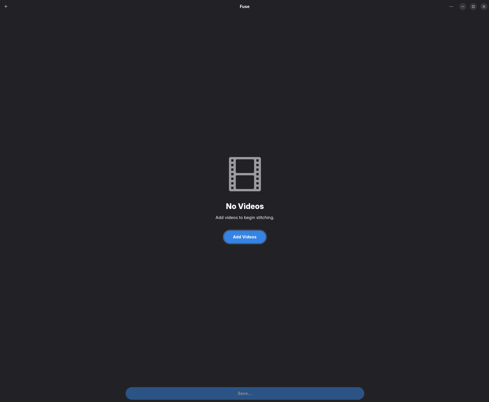

# Fuse

A clean, simple video editor for Linux. Stitch clips together, trim and rotate them, and export to the format you need — all without touching a terminal.

Built with GTK4 and Libadwaita. Powered by ffmpeg under the hood.



---

## Features

- **Stitch** multiple video clips into one — drag to reorder, clips sort by recording date automatically
- **Trim** any clip with a built-in preview and playhead — set in/out points visually or type them in
- **Rotate** clips individually — 90°, 180°, or 270°
- **Enhance** footage automatically — adjusts brightness, contrast, and sharpens detail in one click
- **Output options** — choose your format (MP4, MKV, MOV), codec (H.264 or H.265), quality, encoding speed, and audio bitrate
- Settings are remembered between sessions

---

## Installation

### Flatpak (recommended)

```
flatpak install io.github.frazier.Fuse
```

Or build from source:

```
git clone https://github.com/thrillho93/fuse
cd fuse
bash build-flatpak.sh
```

### Run from source

Requires Python 3, GTK4, Libadwaita, and ffmpeg.

```
bash run.sh
```

---

## Requirements

- ffmpeg and ffprobe must be available on your PATH (handled automatically in the Flatpak)
- GTK 4.0 and Libadwaita 1.0 or later

---

## License

MIT
